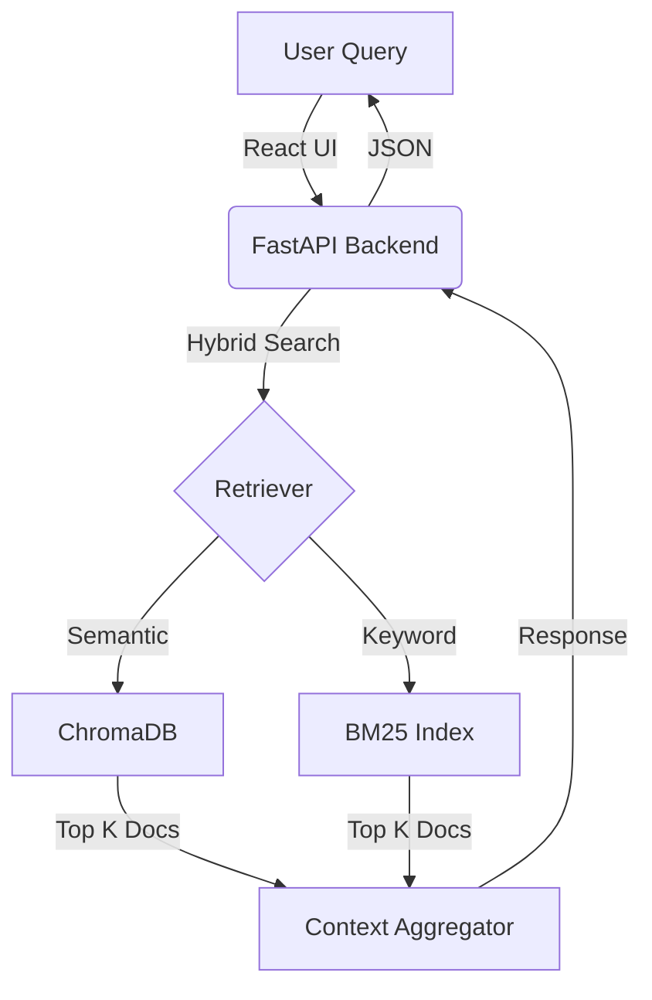

# 📄 IntelliDocs: Intelligent RAG System


> **Build your own Google for Documents.**  
> IntelliDocs is a production-ready Retrieval Augmented Generation (RAG) system that ingests PDF research papers, understands their semantic meaning, and allows users to query them via a modern chat interface.

---

## 🚀 Features

- **📚 PDF Ingestion Pipeline**: Automatically processes, chunks, and cleans raw PDF text from ArXiv.
- **🧠 Semantic Search**: Uses `BAAI/bge-base-en` embeddings to find concepts, not just keywords.
- **⚡ Hybrid Retrieval**: Combines Vector Search (ChromaDB) with Keyword Search (BM25) for high-precision results.
- **🎨 Modern UI**: A sleek, dark-mode React interface built with **Vite** & **TailwindCSS**.
- **🚀 High-Performance Backend**: Powered by **FastAPI** for asynchronous, non-blocking query handling.
- **🔧 Fine-Tuning Scaffolding**: Includes full QLoRA pipeline scripts (`train.py`) to fine-tune Mistral-7B on your specific domain.

---

## 🛠️ Tech Stack

### Backend
- **Framework**: `FastAPI`
- **Vector Store**: `ChromaDB` (Local Persistent)
- **Orchestration**: `LangChain`
- **Embeddings**: `HuggingFace` (`BAAI/bge-base-en-v1.5`)
- **ML Libraries**: `PyTorch`, `Transformers`, `PEFT`, `BitsAndBytes`

### Frontend
- **Framework**: `React` (Vite)
- **Styling**: `TailwindCSS` + `Glassmorphism`
- **Icons**: `Lucide React`
- **Networking**: `Axios`

---

## 🏗️ Architecture



---

## 🏁 Getting Started

### Prerequisites
- Python 3.9+
- Node.js & npm

### 1. Installation
Clones the repo and installs dependencies for both backend and frontend.

```bash
git clone https://github.com/YOUR_USERNAME/intellidocs.git
cd IntelliDocs

# Backend Setup
python -m venv .venv
source .venv/bin/activate
pip install -r requirements.txt

# Frontend Setup
cd frontend
npm install
cd ..
```

### 2. Ingest Data
Download papers and populate the vector database.
```bash
# Fetches ArXiv papers and processes them
python ingestion/fetch_papers.py --query "cat:cs.CL" --max_results 5
python ingestion/process_pdfs.py
```

### 3. Launch App
Starts both the FastAPI backend and React frontend with one command.
```bash
chmod +x start_app.sh
./start_app.sh
```

**Visit:** `http://localhost:5173`

---

## 🧠 Fine-Tuning (Advanced)

IntelliDocs includes a complete pipeline to fine-tune **Mistral-7B** on your document set.

1.  **Generate Dataset**: `python finetuning/generate_qa.py` (Requires OpenAI Key)
2.  **Run QLoRA Training**: `python finetuning/train.py` (Requires NVIDIA GPU)

---

## 📜 License
MIT License. Free to use and modify.