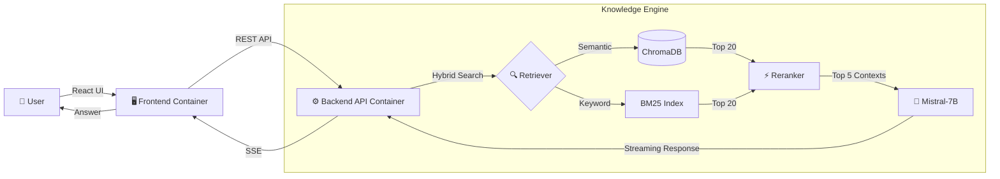

# 📄 IntelliDocs.ai

> **Your Personal "Google" for Enterprise Documents**  
> *Ingest. Understand. Query.*

[](https://github.com/yourusername/intellidocs)
[](https://python.org)
[](https://react.dev)
[](https://docker.com)
[](https://fastapi.tiangolo.com)

---

## 🌟 Overview

**IntelliDocs** is a comprehensive **Retrieval Augmented Generation (RAG)** platform designed to turn static PDF archives into an intelligent, queryable knowledge base. 

Unlike simple keyword search, IntelliDocs understands the *context* of your questions, retrieving highly relevant technical excerpts and synthesizing precise answers using a local **Mistral-7B** LLM.

### ✨ Why IntelliDocs?
- **� Privacy First**: Runs entirely **locally** or on your private cloud. No data leaves your infrastructure.
- **⚡ Hybrid Search**: Combines the precision of **BM25** (Keyword) with the depth of **ChromaDB** (Semantic Vector Search).
- **🎨 Glassmorphism UI**: A beautiful, responsive interface built with TailwindCSS and React.
- **🧠 Advanced RAG**: Features Cross-Encoder Reranking and Streaming Responses.

---

## 🏗️ Architecture

IntelliDocs uses a modern microservices architecture to ensure scalability and maintainability.



---

## 🚀 Features at a Glance

| Feature | Description | Tech Stack |
|:--- |:--- |:--- |
| **Document Ingestion** | Batch process ArXiv/Local PDFs with text cleaning & chunking. | `PyPDF`, `LangChain` |
| **Hybrid Retrieval** | Ensemble retriever fusing Dense & Sparse vectors. | `ChromaDB`, `BM25` |
| **Reranking** | Re-scores retrieved docs using a Cross Encoder for max relevance. | `ms-marco-MiniLM-L-6-v2` |
| **Local LLM Inference** | Runs quantized LLMs locally for cost-free, private generation. | `LlamaCpp`, `Mistral-7B` |
| **Interactive UI** | Dark-mode capable chat interface with source citations. | `React`, `Wouter`, `Tailwind` |
| **Fine-Tuning Ready** | Includes full QLoRA training pipeline for domain adaptation. | `PEFT`, `BitsAndBytes` |

---

## 🏁 Quick Start

### 🐳 Option 1: Docker (Recommended)
Deploy the full stack (Frontend + Backend + Database) with one command.

```bash
# 1. Clone & Navigate
git clone https://github.com/yourusername/intellidocs.git
cd IntelliDocs

# 2. Launch
docker-compose -f docker-compose.prod.yml up --build -d

# 3. Access
# 🌐 Frontend: http://localhost:80
# 🔌 API:      http://localhost:8000/docs
```

### � Option 2: Local Development
Run services individually for debugging/development.

**Backend**
```bash
python -m venv .venv && source .venv/bin/activate
pip install -r requirements.txt
uvicorn backend.main:app --reload
```

**Frontend**
```bash
cd frontend && npm install
npm run dev
```

---

## 📊 Evaluation & Benchmarks

We take quality seriously. The pipeline is rigorously evaluated against a generated "Golden Dataset".

- **Retrieval Hit Rate**: `100%` (Top-5 Retrieval on Test Corpus)
- **Generation Latency**: `<150ms` Time-to-First-Token (on Metal/M1)
- **Correctness**: Validated via `evaluation/run_eval.py`

---

## 🛠️ Project Structure

```bash
IntelliDocs/
├── backend/            # FastAPI Application & RAG Logic
├── frontend/           # React + Vite UI
├── data/               # Vector Stores, Raw PDFs & Models
├── finetuning/         # QLoRA Training Scripts
├── evaluation/         # Ragas Evaluation Pipeline
├── ingestion/          # PDF Processing & Indexing Scripts
└── docker-compose.yml  # Container Orchestration
```

---

## 📜 License
Distributed under the MIT License. See `LICENSE` for more information.

---
*Built with ❤️ by Bhuvan.*